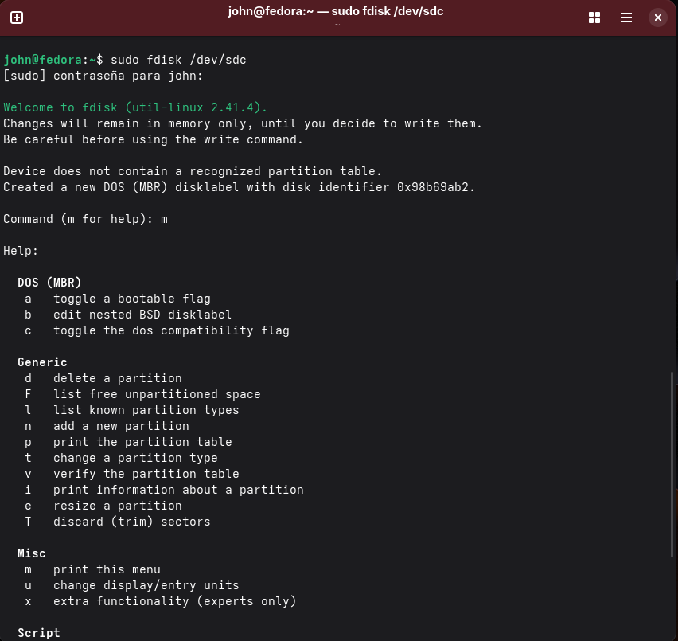

###Gestión de discos en Linux (VirtualBox + /dev + particiones + mount)

###Descripción

En este laboratorio practiqué el flujo completo de gestión de discos en Linux utilizando VirtualBox.
Aprendí cómo se crea un disco virtual, cómo Linux lo detecta en /dev, cómo se divide en particiones y cómo se prepara para ser utilizado mediante filesystem y montaje

1. Creación del disco en VirtualBox
Inicie la máquina virtual y fui a la configuración de almacenamiento en VirtualBox.
Agregué un nuevo disco duro virtual con las siguientes características:

Formato: VDI (VirtualBox Disk Image)
Tamaño: 3 GB
Tipo: dinámico

Luego inicié nuevamente Fedora.